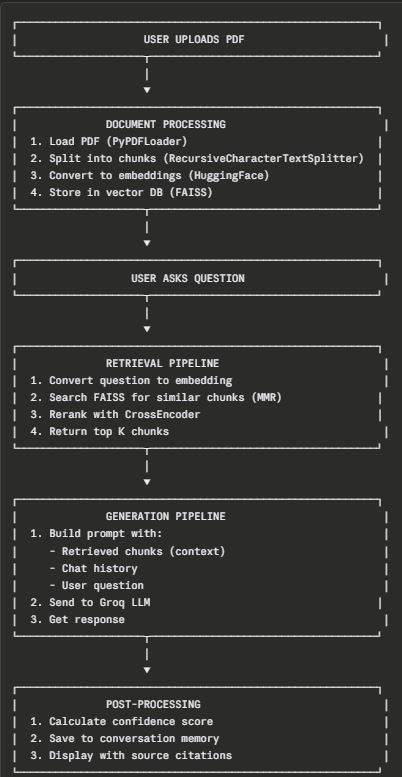

# System Architecture
DocuMind AI follows a Retrieval Augmente Generation (RAG) pipeline.

# Flow

# Key Components

Retriever
Uses FAISS vector similarity search to retrieve relevant document chunks.

Reranker
Uses BAAI BGE CrossEncoder to improve relevance ordering.

Context Builder
Top ranked chunks are combined into a context window.

LLM
Groq-hosted LLaMA model generates the final answer.